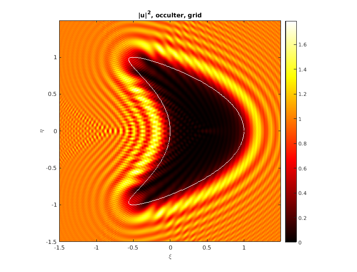
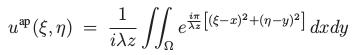
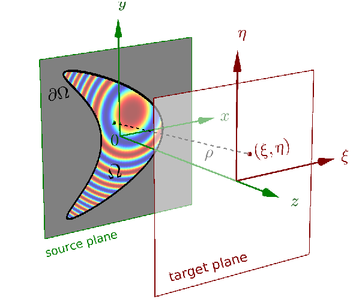

# fresnaq

**FRESN**el **A**real **Q**uadrature:
Fast nonuniform Fourier
method for computation of scalar Fresnel diffraction from
binary (hard-edged) apertures and occulters, in MATLAB/Octave.
The simulation of the optics
of [starshades](http://sister.caltech.edu/) for exoplanet imaging
is one application.

*Here is an example. The intensity due to diffraction from a smooth kite-shaped occulter at Fresnel number around 20 is evaluated at one million targets, to 9-digit accuracy, in 0.05 s on a laptop. All fringes are correct and not numerical or sampling artifacts. The occulter boundary is shown in white:*

This package computes 2D Fresnel diffraction integrals of the form:

in the case of a planar aperture &Omega;,
or one minus this in the case of an occulter.
Here _z_ is the propagation distance and &lambda; the wavelength.
The package does this rapidly at a large numbers of target points (&xi;,&eta;),
either on a grid, or arbitrary,
given an accurate areal quadrature for the domain &Omega;. See our
preprint listed at the bottom.

# requirements

* MATLAB (has been tested back to R2016b), or Octave (version >= 4.4)
* [FINUFFT](https://github.com/flatironinstitute/finufft) preferably >= v2.0.0

# installation and testing

Install FINUFFT and compile its MATLAB interface.
Add ``finufft/matlab`` to your MATLAB path.
In MATLAB run ``startup`` then ``fresnaq_grid`` to run tests which should
produce very small error outputs and take <0.1 sec to run.

The main library functions we provide are:

* ``fresnaq_grid.m`` : compute diffracted amplitude on regular square centered grid
* ``fresnaq_pts.m`` : compute diffracted amplitude at arbitrary target points

Both routines are documented and can be tested by calling them with no arguments. Run ``testall`` to go through all library component tests.

# demos

The user should run ``demo_*.m`` to produce pretty pictures and see
how to call the library.
The above example is produced by setting ``verb=2`` in ``demo_paramcurve.m``.
Since areal quadratures are key, there are various
quadrature helper routines in ``util`` used in the tests and demos.
One starshade description file is shipped in ``occulters``, along with
some preliminary shadow results as PNGs.
A movie sweeping wavelength is [here](https://users.flatironinstitute.org/~ahb/images/fres_sweep.mp4), which took only 30 s to compute.
A notch-like perturbation to an ideal starshade is handled and demo'ed by
``utils/starshadenotch.m``.

# example application to SISTER PSF basis

The directory ``sister_mods`` contains a self-contained subset of the SISTER
codes, essentially ``sister_basis.m`` and everything it requires, severely
hacked to use FRESNAQ instead of BDWF. The speed-up achieved is around
10000x, not including file I/O, and one PSF pupil grid is validated to
6-digit accuracy.

# reference boundary line integral methods

See ``bdrymeths`` directory for BDWF and the new reference non-singular line integral (NSLI) method for Fresnel scalar diffraction.
BDWF was needed as the current state of the art; we ship a documented version
of Cady's code from SISTER v1.1.
This is used for speed comparisons and validation.
NSLI is a more robust and mathematically simpler formulation
in the on-axis, constant-z case,
which also can achieve high-order accuracy (unlike BDWF which is 2nd-order),
when fed an appropriate boundary quadrature. NSLI contains only around eight lines of code (but much more in the form of documentation and testing).

**Note**: The term "boundary integral" refers to a line integral over the aperture/occulter boundary, and should not be confused with 3D integral-equation based wave scattering methods (which would go beyond the Fresnel approximation, and are significantly more time consuming and harder to code).

# details and citation

Please see our preprint here, and cite this if you use this software:

  * Efficient high-order accurate Fresnel diffraction via areal quadrature and the nonuniform FFT, Alex H. Barnett, 2020. [arxiv](https://arxiv.org/abs/2010.05978)

The codes used to generate all figures and tables in this paper is in the ``paper/fig_gen_codes`` directory.